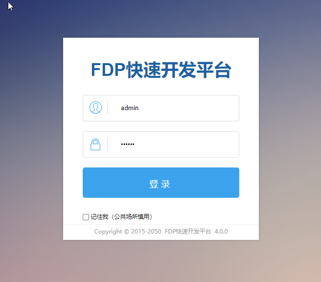
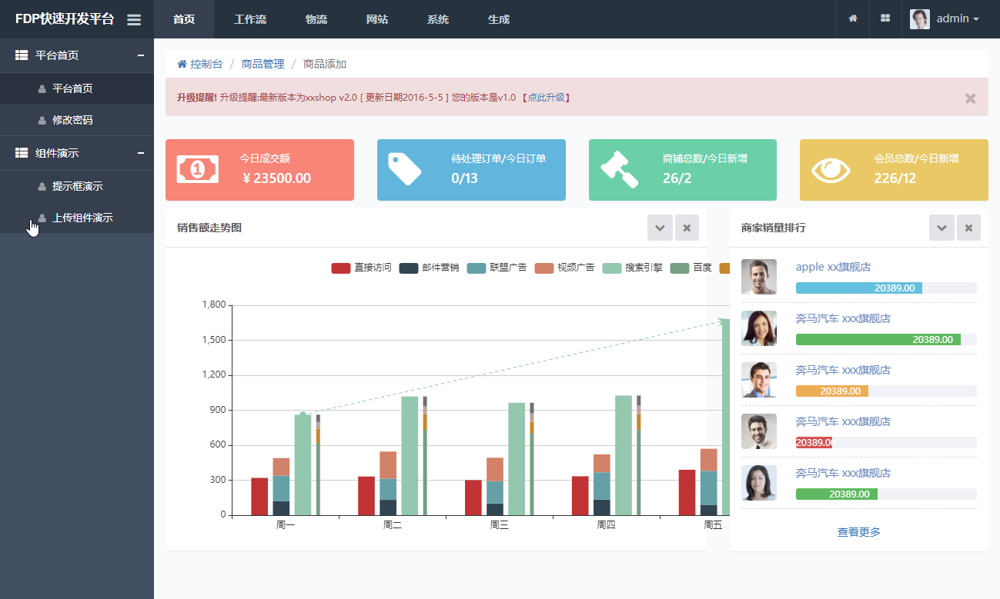

# FDP快速开发平台

## FDP快速开发平台介绍
FDP是Fast development platform的缩写，意为快速开发平台。用于快速开发企业级web项目。

基于spring mvc+mybatis+oracle\mysql+freemarker\beetl+jsp+jquery+ztree+bootstrap等开源框架为基础，并参考借鉴了优秀开源项目jeesite\MyBatis Generator\Mybatis-Plus\jeecms\spring side\discuz等等，并结合多年开发经验的最佳实践。

FDP以Spring Framework为核心容器，Spring MVC为模型视图控制器，MyBatis为数据访问层， Apache Shiro为权限授权层，Ehcahe\Redis对常用数据进行缓存，Activit为工作流引擎。

已内置企业信息化系统的基础功能和高效的代码生成工具，包括：系统权限组件、数据权限组件、数据字典组件、核心工具组件、视图操作组件、工作流组件、代码生成等。

前端界面风格采用了结构简单、性能优良、页面美观大气的Twitter Bootstrap页面展示框架。

采用分层设计、双重验证、提交数据安全编码、密码加密、访问验证、数据权限验证。

使用Maven做项目管理，提高项目的易开发性、扩展性。

FDP提供了常用工具进行封装，包括日志工具、缓存工具、服务器端验证、数据字典、当前组织机构数据（用户、机构、区域）以及其它常用小工具等。

## FDP的文档
FDP快速开发平台的文档  
https://www.sicheng.net/guide-fdp/

## FDP的工程结构
FDP是Maven多模块结构(从FDP3.1起)   
由以下子模板组成：  
fdp-data    复用基础模块，Dao数据访问层、SQL、实体对象，打出jar,被多个War包引用，达到复用的目的。     
fdp-web-admin  管理后台模块，打出war包。比如一个CMS系统的后台，是相对独立的，有单独登录、用户、权限。   
fdp-web-static 静态资源模块，打出war包。    
fdp-web-upload 上传模块，专门处理上传、下载、存储、缩图。         
fdp-web-front  前台模块，比如一个CMS系统的前台，是相对独立的，有单独登录、用户、权限。未建立，当你需要时再建立。
fdp-web-wap  移动端接口模块。

## 依赖的库
FDP依赖fdp-core 基础工具库。  
fdp-core是一套基础组件库，FDP 生态内的系统都依赖fdp-core。fdp-core从具体的业务系统抽取并独立出来，行成基础组件库，并反哺给业务系统使用。
这样做的目的是：维护一套集中统一的“基础组件库” 供众多业务系统、客户项目使用，他们都依赖fdp-core基础组件库，实现复用基础组件的目标，共同升级的目标。

## 建库SQL脚本
fdp40建库脚本-mysql-20220417.sql

## 账号信息
管理后台首页地址：    
http://127.0.0.1:8081/admin/index.do   （IP、端口请根据你的情况修改）    
用户名：admin ,密码123456  超级管理员    
用户名：system ,密码123456  系统管理员

## 地址
admin模块：http://localhost:8080/admin/    
front模块：http://localhost:8080/
front模块：http://localhost:8080/cms/index.htm    
static模块：http://localhost:8080/static/    
上传模块：http://localhost:8080/upload/    
wap模块地址：http://localhost:8080/wap/    
swagger接口地址：http://localhost:8080/wap/swagger-ui.html#/

### 登录页

### 首页
     
